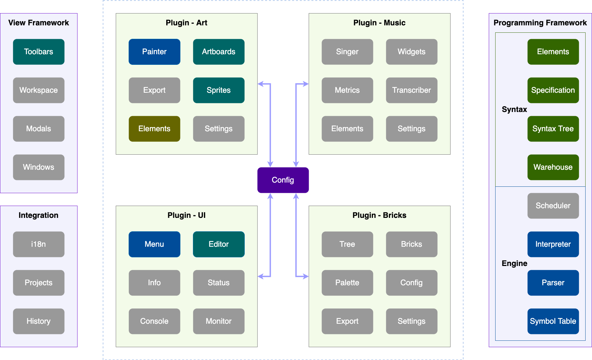
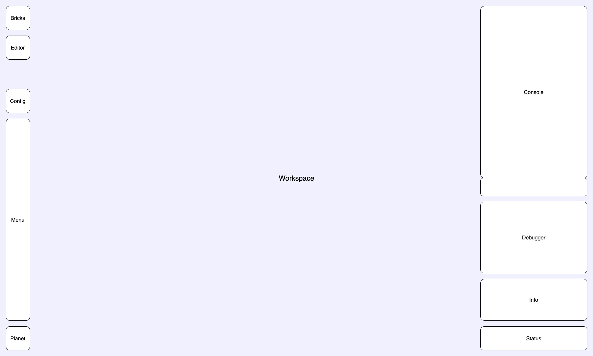

# Music Blocks (v4)

A complete overhaul of [Music Blocks](https://github.com/sugarlabs/musicblocks).

## Proposed Architecture

The aim of the new architecture is modularity and extensibility. The idea is to create a core visual
programming platform, and extend it with other features.

- The source code for the components specific to the application resides in this
[**musicblocks-v4**](https://github.com/sugarlabs/musicblocks-v4/) repository.

- The source code for the programming framework resides in the
[**musicblocks-v4-lib**](https://github.com/sugarlabs/musicblocks-v4-lib/) repository.

- **musicblocks-v4-lib** is bundled as an _npm_ package and imported as a dependency in
**musicblocks-v4**.

### Components



**Note:** The greyed out components haven't been built yet.

This is a highly pluggable architecture — except for application level functionality, anything related
to project building and execution are features which shall be dynamically pluggable (they may or may
not be configured to load).

Components can be strictly or partially dependent on other components. In case of strict dependency,
a depending component needs to be loaded for a dependent component to be loaded. In case of partial
dependency, a dependent component adds extra functionality to the depending component if it is loaded.

#### Programming Framework

This is reponsible for defining the _syntax constructs_ (_syntax elements_, _syntax tree_) and
utilities (_syntax specification_, _syntax warehouse_), and contains the _execution engine_
(_scheduler_, _interpreter_, _parser_, _symbol table_) for running the program represented by the
_syntax tree_. See
[`musicblocks-v4-lib/README.md`](https://github.com/sugarlabs/musicblocks-v4-lib/blob/develop/README.md)
for details.

The components in `musicblocks-v4` shall use the constructs exposed by `musicblocks-v4-lib`.

#### View Framework

This is responsible for creating the skeleton of the UI — components that have a view shall request
component wrappers from the _view framework_ and encapsule their DOM inside the wrappers.

#### Integration

This is responsible for adding general application-wide functionalities like _internationalisation_,
_project management_, and _activity history_.

#### Plugin - UI

This contains UI components for application-wide interactive/informative functionality.

#### Plugin - Art

This is responsible for artwork generation. It shall contain a set of _syntax elements_ of
instructions and arguments related to artwork generation and artboard (artwork canvas) states.

#### Plugin - Music

This is responsible for music generation. It shall contain a set of _syntax elements_ of
instructions and arguments related to music generation, composition, and music states.

#### Plugin - Bricks

This is responsible for building Music Blocks programs using graphical bricks (blocks).

#### Config

This is responsible for conditionally loading the pluggable components dynamically and sharing instance
references between them.

### Wireframe



## Contributing

Please visit the [discussions](https://github.com/sugarlabs/musicblocks-v4/discussions) tab at the
top of the repository to follow and/or discuss about the planning progress.

A prototype has been built currently. Parallel development of the programming framework will be done
in the [**musicblocks-v4-lib**](https://github.com/sugarlabs/musicblocks-v4-lib) repository as mentioned
above. For updates, follow the `develop` branch and the feature branches that branch out of it.
Please look out for _Issues_ tab of both repositories.

### New Contributors

Use the [discussions](https://github.com/sugarlabs/musicblocks-v4/discussions) tab at the top of
the repository to:

- Ask questions you're wondering about.
- Share ideas.
- Engage with other community members.

Feel free. But, please don't spam :p.

### Keep in Mind

1. Your contributions need not necessarily have to address any discovered issue. If you encounter any,
feel free to add a fix through a PR, or create a new issue ticket.

2. Use [labels](https://github.com/sugarlabs/musicblocks-v4/labels) on your issues and PRs.

3. Do not spam with lots of PRs with little changes.

4. If you are addressing a bulk change, divide your commits across multiple PRs, and send them one at
a time. The fewer the number of files addressed per PR, the better.

5. Communicate effectively. Go straight to the point. You don't need to address anyone using '_sir_'.
Don't write unnecessary comments; don't be over-apologetic. There is no superiority hierarchy. Every
single contribution is welcome, as long as it doesn't spam or distract the flow.

6. Write useful, brief commit messages. Add commit descriptions if necessary. PR name should speak about
what it is addressing and not the issue. In case a PR fixes an issue, use `fixes #ticketno` or
`closes #ticketno` in the PR's comment. Briefly explain what your PR is doing.

7. Always test your changes extensively before creating a PR. There's no sense in merging broken code.
If a PR is a _work in progress (WIP)_, convert it to draft. It'll let the maintainers know it isn't
ready for merging.

8. Read and revise the concepts about programming constructs you're dealing with. You must be clear
about the behavior of the language or compiler/transpiler. See
[JavaScript docs](https://developer.mozilla.org/en-US/docs/Web/JavaScript) and [TypeScript docs](https://www.typescriptlang.org/docs/).

9. If you have a question, do a _web search_ first. If you don't find any satisfactory answer, then
ask it in a comment. If it is a general question about Music Blocks, please use the new
[discussions](https://github.com/sugarlabs/musicblocks/discussions) tab on top the the repository, or
the _Sugar-dev Devel <[sugar-devel@lists.sugarlabs.org](mailto:sugar-devel@lists.sugarlabs.org)>_ mailing
list. Don't ask silly questions (unless you don't know it is silly ;p) before searching it on the web.

### Code Quality Notes

1. Sticking to _TypeScript_ conventions, use _camelCase_ for filenames (_PascalCase_ for _class_ files),
_CAPITALCASE_ for constants, _camelCase_ for identifiers, and _PascalCase_ for _classes_. Linting has
been strictly configured. A `super-linter` is configured to lint check the files on a pull request.
In fact, the _TypeScript_ watcher or build will throw errors/warnings if there are linting problems.
This has been done to maintain code quality.

2. If a PR is addressing an issue, prefix the branch name with the issue number. For example, say a
PR is addressing issue `100`, a branch name could be `100-patch-foobar`.

3. Meaningfully separate code across commits. Don't create arbitrary commits. In case it gets dirty,
please do an _interactive rebase_ with _squash_ and _reword_ to improve.

4. Follow [conventional commit messages specification](https://www.conventionalcommits.org/en/v1.0.0-beta.2/)
to help issue tracking. More often than not, take time to add meaningful commit descriptions. However,
add specificity by mentioning the component; prefer `mycomponent: [feat] Add button` over
`feat: Add button`, `mycomponent: [fix] Use try-catch` over `fix: Use try-catch`.

5. At any point, when new components are created or existing components are modified, unit tests (passing)
reflecting the changes need to be part of the PR before being reviewed.

6. Two workflows -- a _Continuous Integration_ (_CI_) and a _Linter_ (_Super Linter_), have been configured.
Each PR must pass the checks before being reviewed.

7. For any new functions/methods or classes, add extensive [TSDoc](https://tsdoc.org/) documentation.

8. Each PR needs to have supporting unit tests covering all (or as much practical) use cases to qualify
for review. In case testing is done via some non-standard method, adequate description of the method/s
need/s to be specified in the PR body.

_Please note there is no need to ask permission to work on an issue. You should check for pull requests
linked to an issue you are addressing; if there are none, then assume nobody has done anything. Begin
to fix the problem, test, make your commits, push your commits, then make a pull request. Mention an
issue number in the pull request, but not the commit message. These practices allow the competition
of ideas (Sugar Labs is a meritocracy)._

## Tech Stack

Music Blocks v4 shall be built using `TypeScript 4`and `React 17 (with hooks)`. In addition, `SCSS`
shall be used for styling; `Webpack` will be configured to transpile and bundle the source code, for
deployment on a web browser.

## Setup Development Environment

### Without Docker

This is a _**TypeScript**_ project that uses _**React**_. You'll just need
_[**Node.js**](https://nodejs.org/en/)_ and _**npm**_ installed on your development machine_.
Although, this is sufficient to run, build, and test the project as a whole, you might need some
extra tools for other development tasks.

You'll need _**tsc**_ (_TypeScript Compiler_) to manually compile `.ts` files. You'll need
_**ts-node**_ (_Node.js executable for TypeScript_) to manually execute `.ts` scripts directly. Finally,
you'll need an _HTTP_ server like _**http-server**_ (_a HTTP server program_), if you want to serve
files manually.

Once _**npm**_ is installed, to install the above, run

```bash
npm i -g http-server
npm i -g typescript
npm i -g ts-node
```

_**Note:**_ Users on _Linux_ and _MacOS_ are required to add a `sudo` before these commands.

Check installation using

```bash
node -v && npm -v && tsc -v && ts-node -v && http-server -v
```

Output should look like

```bash
v14.17.0
6.14.13
Version 4.3.2
v10.0.0
v0.12.3
```

### With Docker

This project development tools have been containerized using [**docker**](https://www.docker.com/).
Therefore, to use an execution sandbox, it requires **docker** to be installed on the development
machine.

1. Setup _docker_.

    - For _Linux_, [install _Docker Engine_](https://docs.docker.com/engine/install/). You'll also
    need to [install _Docker Compose_](https://docs.docker.com/compose/install/).

    - For _Windows_ or _Mac_, [install _Docker Desktop_](https://www.docker.com/products/docker-desktop).

2. Open a terminal and navigate to working directory (where the source code will reside).

3. _Git Clone_ (additional [installation](https://git-scm.com/downloads) of _Git_ required on
Windows) this repository using

    ```bash
    git clone https://github.com/sugarlabs/musicblocks-v4.git
    ```

4. Build _docker image_ and launch _docker network_.

    _**Note:**_ A
    [built initial development image](https://github.com/sugarlabs/musicblocks-v4/pkgs/container/musicblocks/2948273?tag=4.0.0-dev)
    has been published to
    [_Sugar Labs GitHub Container Registry_ (_GHCR_)](https://github.com/orgs/sugarlabs/packages?ecosystem=container),
    which can be pulled directly, so you don't have to build it again. Pull using

    ```bash
    docker pull ghcr.io/sugarlabs/musicblocks:4.0.0-dev
    ```

    Nagivate inside the project directory and launch the _docker network_ using

    ```bash
    docker-compose up -d
    ```

    or (for _Docker v1.28_ and above)

    ```bash
    docker compose up -d
    ```

    If you haven't pulled the image from the _GitHub Container Registry_ (_GHCR_), it'll first build
    the image using the `Dockerfile`, then launch the _docker network_. If an image already exists
    locally, it'll not be rebuilt. To force a rebuild from the `Dockerfile` before launching the
    _docker network_, add the `--build` flag.

5. In a second terminal, run

    ```bash
    docker attach musicblocks-4.0.0-dev
    ```

    The _Alpine shell_ in the _docker container_ named _musicblocks-4.0.0-dev_ is spawned and
    standard input/output is connected to the terminal.

6. _**Node.js**_ (_Node.js Runtime_), _**npm**_ (_Node.js Package Manager_), _**tsc**_ (_TypeScript
    Compiler_), _**ts-node**_ (_Node.js executable for TypeScript_), and _**http-server**_ (_a HTTP
    server program_) should be installed. Check using

    ```bash
    node -v && npm -v && tsc -v && ts-node -v && http-server -v
    ```

    Output should look like

    ```bash
    v14.17.0
    6.14.13
    Version 4.3.2
    v10.0.0
    v0.12.3
    ```

7. To shut down the _docker network_, run (in the terminal where you ran `docker-compose up -d` or
`docker compose up -d`)

    ```bash
    docker-compose down
    ```

    or (for _Docker v1.28_ and above)

    ```bash
    docker compose down
    ```

### Disclaimer

Hot reloading currently does not work, so every time you make a change, you need to refresh the
browser manually. This issue does not occur in productions builds. The production build works
totally fine on the Chromium-based webkit browsers, Firefox, and Safari.

This project is setup using `create-react-app` which uses `react-scripts@v4.0.3`.The webpack
version it uses has some issues with hot-reloading which is causing the problem. This problem is
temporary and will be fixed in the future.

## Commands

**Note: This repository uses `sugarlabs/musicblocks-v4-lib` as an _npm_ package which is published to
the _GitHub npm Registry_ of Sugar Labs. Before you install the dependencies you need to make sure that
your _GitHub Personal Access Token_ (_PAT_) is stored in your local system's _npm_ configuration file
`.npmrc`.**

**Note: Be sure to request permission for ```read: packages```**

Learn
[how to create a _PAT_](https://docs.github.com/en/authentication/keeping-your-account-and-data-secure/creating-a-personal-access-token#creating-a-token).

Add your _PAT_ to `.npmrc` using

```bash
echo "//npm.pkg.github.com/:_authToken=[YOUR_GITHUB_PERSONAL_ACCESS_TOKEN]" >> ~/.npmrc
```

After you are set-up, the steps you take depend on what you want to do:

- **Run a development server and test suites**

    1. To install all the dependencies (in `package.json`), run

        ```bash
        npm ci
        ```

    2. Run _React scripts_.

        - For unoptimized development serving, run

            ```bash
            npm start
            ```

            This is spawned on `127.0.0.1:3000` inside the container, but mapped to `localhost:5000`
            on host. Visit `localhost:5000` in a browser to view the web page served. If you are not
            using the container, visit `localhost:3000`.

        - For testing, run

            ```bash
            npm run test
            ```

        - For generating a production build, run

            ```bash
            npm run build
            ```

        _**Note:**_ If you're running using _Docker Desktop_ on _Windows_ or _Mac_, you might experience
        longer execution times for these scripts. This happens due to cross-file-system communication.
        Duration varies across machines; duration primarily depends on hard drive read/write speed.

- **HTTP server**

  To spawn an _HTTP Server_ (uses _Python 3_'s `http.server`), run

    ```bash
    npm run serve
    ```

    This is spawned on `0.0.0.0:80` inside the container, but mapped to `localhost:5001` on host.
    Visit `localhost:5001` in a browser to view the web page served. If you are not using the
    container, visit `localhost:80`.

- **Miscellaneous commands**

  _**Note:**_ This requires _**Node.js**_ (_Node.js Runtime_), _**tsc**_ (_TypeScript Compiler_), and
  _**ts-node**_ (_Node.js executable for TypeScript_) to be installed. If you are using _Docker_, they'll
  be pre-installed in the container.

  - To launch the _Node.js runtime_, run

    ```bash
    node
    ```

  - To run a _JavaScript_ file, say `file.js`, run

    ```bash
    node file.js
    ```

  - To transpile a _TypeScipt_ file, say `file.ts`, to _JavaScript_, run

    ```bash
    tsc file.ts
    ```

    This transpilation produces `file.js`.

  - To run a _TypeScript_ file directly, say `file.ts`, run

    ```bash
    ts-node file.ts
    ```

## Editor

_All code is just plain text, so it doesn't really matter what you use to edit them._ However,
using modern, feature-rich IDEs/text-editors like [_**Atom**_](https://atom.io/),
[_**Brackets**_](https://brackets.io), [_**WebStorm**_](https://www.jetbrains.com/webstorm/),
[_**Sublime Text**_](https://www.sublimetext.com/),
[_**Visual Studio Code**_](https://code.visualstudio.com/), etc. makes life way easier. These come
with a directory-tree explorer, and an integrated terminal, at the very least, while having support
for plugins/extensions to expand their functionality.

Some (non-exhaustive) benefits of using these are _syntax highlighting_,
_warning/error annotations_, _formatting_, _auto-refactoring_, tons of customizable
_keyboard shortcuts_, etc.

_**Visual Studio Code**_ (_**VSCode**_) is currently the most-popular code editor for reasons like
being _lightweight_, _cleaner_, large marketplace of _extensions_, integrated _source control_
features, _debugger_, _remote explorer_ support, _regular expression_ based find/replace, etc.

In fact, a workspace configuration file for _vscode_`.vscode/settings.json` has already been added.
Recommended extensions for this project are `Babel JavaScript`, `Docker`, `ESLint`, `Git Graph`,
`GitLens`, `markdownlint`, `Prettier`, `SCSS IntelliSense`, and `SVG`.

All that, however, shouldn't necessarily stop you from using _**Emacs**_, _**Nano**_, or _**Vim**_,
if that's your poison :D. Happy coding!
