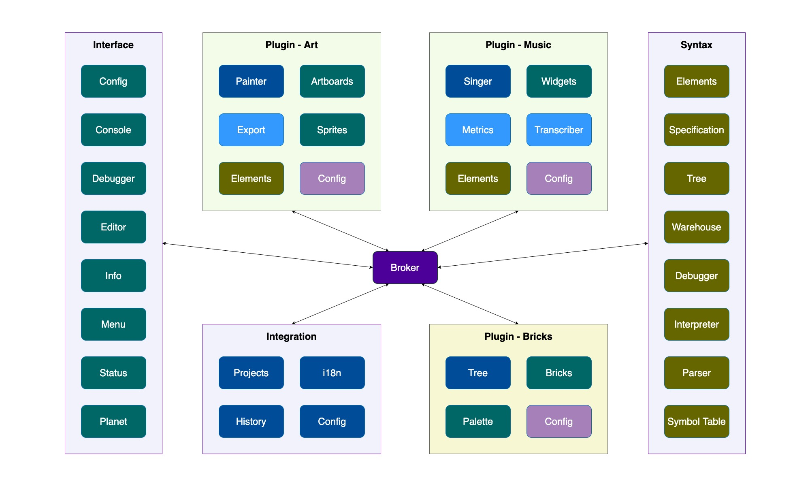

# Music Blocks (v4)

A complete overhaul of [Music Blocks](https://github.com/sugarlabs/musicblocks).

## Proposed Architecture



- 5 component clusters: **Foreground**, **Background**, **Syntax**, **Engine**, **Server**

- **Foreground** cluster contains the UI components. These are the only ones which use *React* and
follow *Model-View-ViewModel* (*MVVM*) architecture.

- **Background** cluster contains the components which are specific to the application client
(browser for now) but are not UI components. These are *TypeScript* classes that may wrap client
specific libraries.

- **Syntax** cluster contains the components that handle how Music Blocks programs are represented.
These are not client specific.

- **Engine** cluster contains the components responsible for handling the execution of Music Blocks
programs and other computatation-driven actions like export to sheet music.

- **Server** cluster contains the components that handle server side actions. This is part of a
new feature proposal and are not a priority until the first stable release.

- The **Monitor** and **Broker** components are bridges for inter-component communication.

- The source code for the **Foreground** and **Background** clusters will reside in the
[**musicblocks-v4**](https://github.com/sugarlabs/musicblocks-v4/) repository. The source code for
the **Syntax** and **Engine** clusters will reside in the
[**musicblocks-v4-lib**](https://github.com/sugarlabs/musicblocks-v4/) repository. **Monitor** will
be part of the prior, and **Broker** will be part of the later.

- The **musicblocks-v4-lib** will be bundled as an *NPM* package and imported as a dependency in
**musicblocks-v4**.

## Contributing

Please visit the [discussions](https://github.com/sugarlabs/musicblocks-v4/discussions) tab at the
top of the repository to follow the planning progress.

A prototype is being built currently. Parallel development will be done in the
[**musicblocks-v4-lib**](https://github.com/sugarlabs/musicblocks-v4-lib) repository as mentioned
above. For updates, follow the `develop` branch and the feature branches that branch out of it.
Please look out for *Issues* tab of both repositories.

## Tech Stack

Music Blocks v4 shall be built using `React 17 (with hooks)` and `TypeScript 4`. In addition,
`SCSS` shall be used for styling. `Webpack` has been configured to transpile and bundle the source
code, for deployment on a web browser.

## Setup Development Environment

_This project is containerized using [**docker**](https://www.docker.com/). Therefore, it requires
**docker** to be installed on the development machine._

1. Setup _docker_.

    - For _Linux_, [install _Docker Engine_](https://docs.docker.com/engine/install/).
    - For _Windows_ or _Mac_ (_x86_64 / amd64_),
    [install _Docker Desktop_](https://www.docker.com/products/docker-desktop).

2. Open a terminal and navigate to working directory (where the source code will reside).

3. _Git Clone_ (additional [installation](https://git-scm.com/downloads) of _Git_ required on
Windows) this repository using

    ```bash
    git clone https://github.com/sugarlabs/musicblocks-v4.git
    ```

4. Build _docker image_ and launch _docker network_.

    _**Note:**_ A
    [built initial development image](https://github.com/orgs/sugarlabs/packages/container/musicblocks/2948273?tag=4.0.0-dev)
    has been published to
    [_Sugar Labs GitHub Container Registry_ (_GHCR_)](https://github.com/orgs/sugarlabs/packages?ecosystem=container),
    which can be pulled directly, so you don't have to build it again. Pull using

    ```bash
    docker pull ghcr.io/sugarlabs/musicblocks:4.0.0-dev
    ```

    Nagivate inside the project directory and launch the _docker network_ using

    ```bash
    docker-compose up -d
    ```

    or (for _Docker v1.28_ and above)

    ```bash
    docker compose up -d
    ```

    If you haven't pulled the image from the _GitHub Container Registry_ (_GHCR_), it'll first build
    the image using the `Dockerfile`, then launch the _docker network_. If an image already exists
    locally, it'll not be rebuilt. To force a rebuild from the `Dockerfile` before launching the
    _docker network_, add the `--build` flag.

5. In a second terminal, run

    ```bash
    docker attach musicblocks-4.0.0-dev
    ```

    The _Alpine shell_ in the _docker container_ named _musicblocks-4.0.0-dev_ is spawned and
    standard input/output is connected to the terminal.

6. _**Node**_ (_Node.js Runtime_), _**npm**_ (_Node Package Manager_), _**tsc**_ (_TypeScript
    Compiler_), _**ts-node**_ (_Node executable for TypeScript_), and _**http-server**_ (_a HTTP
    server program_) should be installed. Check using

    ```bash
    node -v && npm -v && tsc -v && ts-node -v && http-server -v
    ```

    Output should look like

    ```bash
    v14.17.0
    6.14.13
    Version 4.3.2
    v10.0.0
    v0.12.3
    ```

The steps you take from here depend on what you want to do:

- **Run test suites and run a development server**

    1. To install all the dependencies (in `package.json`), run

        ```bash
        npm ci
        ```

    2. Run _React scripts_.

        - For unoptimized development serving, run

            ```bash
            npm start
            ```

            This is spawned on `127.0.0.1:3000` inside the container, but mapped to `localhost:5000`
            on host. Visit `localhost:5000` in a browser to view the webpage served.

            Currently this will open a page with a "Hello world!" message.

        - For testing, run

            ```bash
            npm run test
            ```

        - For generating a production build, run

            ```bash
            npm run build
            ```

        _**Note:**_ If you're running using _Docker Desktop_ on _Windows_ or _Mac_, you might experience
        longer execution times for these scripts. This happens due to cross-file-system communication.
        Duration varies across machines; duration primarily depends on hard drive read/write speed.

- **HTTP server**

    To spawn an _HTTP Server_ (uses _Python 3_'s `http.server`), run

    ```bash
    npm run serve
    ```

    This is spawned on `0.0.0.0:80` inside the container, but mapped to `localhost:5001` on host.
    Visit `localhost:5001` in a browser to view the webpage served.

- **Shut down docker network**

    To shut down the _docker network_, run (in the terminal where you ran `docker-compose up -d` or
    `docker compose up -d`)

    ```bash
    docker-compose down
    ```

    or (for _Docker v1.28_ and above)

    ```bash
    docker compose down
    ```

- **Miscellaneous commands**

    - To launch the _Node runtime_, run

        ```bash
        node
        ```

    - To run a _JavaScript_ file, say `file.js`, run

        ```bash
        node file.js
        ```

    - To transpile a _TypeScipt_ file, say `file.ts`, to _JavaScript_, run

        ```bash
        tsc file.ts
        ```

        This transpilation produces `file.js`.

    - To run a _TypeScript_ file directly, say `file.ts`, run

        ```bash
        ts-node file.ts
        ```

## Editor

_All code is just plain text, so it doesn't really matter what you use to edit them._ However,
using modern, feature-rich IDEs/text-editors like [_**Atom**_](https://atom.io/),
[_**Brackets**_](http://brackets.io/), [_**WebStorm**_](https://www.jetbrains.com/webstorm/),
[_**Sublime Text**_](https://www.sublimetext.com/),
[_**Visual Studio Code**_](https://code.visualstudio.com/), etc. makes life way easier. These come
with a directory-tree explorer, and an integrated terminal, at the very least, while having support
for plugins/extensions to expand their functionality.

Some (non-exhaustive) benefits of using these are _syntax highlighting_,
_warning/error annotations_, _formatting_, _auto-refactoring_, tons of customizable
_keyboard shortcuts_, etc.

_**Visual Studio Code**_ (_**VSCode**_) is currently the most-popular code editor for reasons like
being _lightweight_, _cleaner_, large marketplace of _extensions_, integrated _Source Control_
features, _debugger_, _remote explorer_ support, _Regular Expression_ (_regex_) based find/replace,
etc.

In fact, a workspace configuration file for _vscode_`.vscode/settings.json` has already been added.
Recommended extensions for this project are `Babel JavaScript`, `Docker`, `ESLint`, `Git Graph`,
`GitLens`, `markdownlint`, `Prettier`, `SCSS IntelliSense`, and `SVG`.

All that, however, shouldn't necessarily stop you from using _**Emacs**_, _**Nano**_, or _**Vim**_,
if that's your poison :D. Happy coding!
