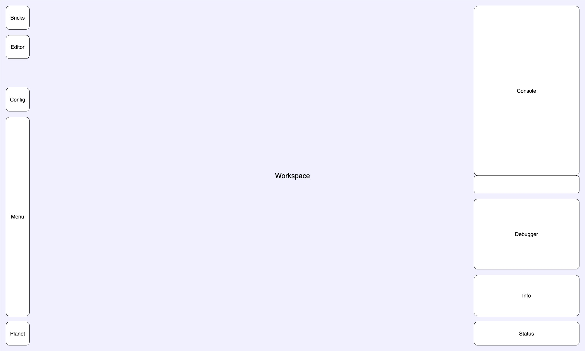

# Architecture

The aim of the new architecture is modularity and extensibility. The idea is to create a core visual
programming platform, and extend it with other features.

- The source code for the components specific to the application resides in this
[**musicblocks-v4**](https://github.com/sugarlabs/musicblocks-v4/) repository.

- The source code for the programming framework resides in the
[**musicblocks-v4-lib**](https://github.com/sugarlabs/musicblocks-v4-lib/) repository.

- **musicblocks-v4-lib** is bundled as an _npm_ package and imported as a dependency in
**musicblocks-v4**.

## Components

**Note:** The greyed out components haven't been built yet.

This is a highly pluggable architecture — except for application level functionality, anything related
to project building and execution are features which shall be dynamically pluggable (they may or may
not be configured to load).

Components can be strictly or partially dependent on other components. In case of strict dependency,
a depending component needs to be loaded for a dependent component to be loaded. In case of partial
dependency, a dependent component adds extra functionality to the depending component if it is loaded.

### Programming Framework

This is reponsible for defining the _syntax constructs_ (_syntax elements_, _syntax tree_) and
utilities (_syntax specification_, _syntax warehouse_), and contains the _execution engine_
(_scheduler_, _interpreter_, _parser_, _symbol table_) for running the program represented by the
_syntax tree_. See
[`musicblocks-v4-lib/README.md`](https://github.com/sugarlabs/musicblocks-v4-lib/blob/develop/README.md)
for details.

The components in `musicblocks-v4` shall use the constructs exposed by `musicblocks-v4-lib`.

### View Framework

This is responsible for creating the skeleton of the UI — components that have a view shall request
component wrappers from the _view framework_ and encapsule their DOM inside the wrappers.

### Integration

This is responsible for adding general application-wide functionalities like _internationalisation_,
_project management_, and _activity history_.

### Plugin - UI

This contains UI components for application-wide interactive/informative functionality.

### Plugin - Art

This is responsible for artwork generation. It shall contain a set of _syntax elements_ of
instructions and arguments related to artwork generation and artboard (artwork canvas) states.

### Plugin - Music

This is responsible for music generation. It shall contain a set of _syntax elements_ of
instructions and arguments related to music generation, composition, and music states.

### Plugin - Bricks

This is responsible for building Music Blocks programs using graphical bricks (blocks).

### Config

This is responsible for conditionally loading the pluggable components dynamically and sharing instance
references between them.

## Wireframe

