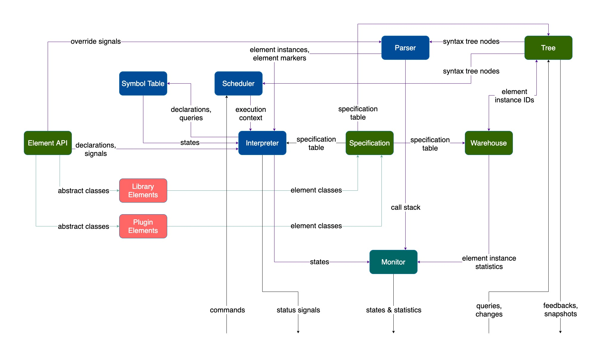

# Programming framework of musicblocks-v4

[](https://github.com/sugarlabs/musicblocks-v4-lib/actions/workflows/lint.yml)
[](https://github.com/sugarlabs/musicblocks-v4-lib/actions/workflows/CI.yml)
[](https://github.com/sugarlabs/musicblocks-v4-lib/actions/workflows/CD.yml)

This repository contains the source code for the programming framework of the new
[Music Blocks (v4)](https://github.com/sugarlabs/musicblocks-v4) application.

## Architecture



### Syntax Representation

- **Element API** represents *syntax elements* — the atomic constructs for building programs. There
are 2 kinds of *syntax elements*:

  - **Arguments** which return values. These are of 2 types:

    - **Data** which return a value inherently and without operating on other provided values

    - **Expression** which return a value after operating on other provided values

  - **Instructions** which perform a task. These are of 2 types:

    - **Statements** perform a single task

    - **Blocks** encapsulate *statements* and generally set some states or control the flow to them

- **Specification** maintains a table of actual *syntax elements* which can be used to build programs.

- **Warehouse** maintains a table of instances of *syntax elements* registered in the *specification*.
It can also generate statistics about the instances.

- **Tree** represents the *syntax tree* (*abstract syntax tree* or *AST*) by maintaining interconnections
between *syntax elements*.

### Execution

- **Symbol Table** maintains tables of dynamic variables and states which the *syntax elements* can
use during execution.

- **Parser** parses the *syntax tree* in a postorder sequence, and maintains *call frame stacks* and
the *program counter*.

- **Interpreter** fetches elements from the parser and executes them.

- **Scheduler** manages the concurrent orchestration of the execution process.

**Monitor** proxies information about the execution states and statictics.

There are 2 special constructs: **Process** and **Routine**. These are special *block* elements.
**Routines** encapsulate *instructions* that can be executed by multiple **processes**. **Processes**
encapsulate independent set of instructions, and multiple **processes** can run concurrently.

There is an additional terminology called **crumbs** which are sets of connected *syntax elements*
not part of any *process* or *routine*.

### Plugins

The core framework doesn't define any special *syntax elements* other than *process* and *routine*.
All concrete *syntax elements* are plugins which extend the *syntax element API* and are registered
in the *syntax specification*.

A set of programming specific *syntax elements* are bundled as a library, which use nothing beyond
the set of constructs exposed by the *syntax element API*.

## Tech Stack

This core of Music Blocks v4 uses `TypeScript 4`. In addition, `Jest` shall be used for testing.

## Contributing

Programmers, please follow these general
[guidelines for contributions](https://github.com/sugarlabs/docs/blob/master/src/contributing.md).

### New Contributors

Use the [discussions](https://github.com/sugarlabs/musicblocks-v4-lib/discussions) tab at the top of
the repository to:

- Ask questions you’re wondering about.
- Share ideas.
- Engage with other community members.

Feel free. But, please don't spam :p.

### Keep in Mind

1. Your contributions need not necessarily have to address any discovered issue. If you encounter
any, feel free to add a fix through a PR, or create a new issue ticket.

2. Use [labels](https://github.com/sugarlabs/musicblocks-v4-lib/labels) on your issues and PRs.

3. Do not spam with lots of PRs with little changes.

4. If you are addressing a bulk change, divide your commits across multiple PRs, and send them one
at a time. The fewer the number of files addressed per PR, the better.

5. Communicate effectively. Go straight to the point. You don't need to address anyone using
'*sir*'. Don't write unnecessary comments; don't be over-apologetic. There is no superiority
hierarchy. Every single contribution is welcome, as long as it doesn't spam or distract the flow.

6. Write useful, brief commit messages. Add commit descriptions if necessary. PR name should speak
about what it is addressing and not the issue. In case a PR fixes an issue, use `fixes #ticketno` or
`closes #ticketno` in the PR's comment. Briefly explain what your PR is doing.

7. Always test your changes extensively before creating a PR. There's no sense in merging broken
code. If a PR is a *work in progress (WIP)*, convert it to draft. It'll let the maintainers know it
isn't ready for merging.

8. Read and revise the concepts about programming constructs you're dealing with. You must be clear
about the behavior of the language or compiler/transpiler. See
[JavaScript docs](https://developer.mozilla.org/en-US/docs/Web/JavaScript) and
[TypeScript docs](https://www.typescriptlang.org/docs/).

9. If you have a question, do a *web search* first. If you don't find any satisfactory answer, then
ask it in a comment. If it is a general question about Music Blocks, please use the new
[discussions](https://github.com/sugarlabs/musicblocks/discussions) tab on top the the repository,
or the *Sugar-dev Devel <[sugar-devel@lists.sugarlabs.org](mailto:sugar-devel@lists.sugarlabs.org)>*
mailing list. Don't ask silly questions (unless you don't know it is silly ;p) before searching it
on the web.

### Code Quality Notes

1. Sticking to *TypeScript* conventions, use *camelCase* for filenames (*PascalCase* for *class*
files), *CAPITALCASE* for constants, *camelCase* for identifiers, and *PascalCase* for *classes*.
Linting has been strictly configured. A `super-linter` is configured to lint check the files on a
pull request. In fact, the *TypeScript* watcher or build will throw errors/warnings if there are
linting problems. This has been done to maintain code quality.

2. If a PR is addressing an issue, prefix the branch name with the issue number. For example, say a
PR is addressing issue `100`, a branch name could be `100-patch-foobar`.

3. Meaningfully separate code across commits. Don't create arbitrary commits. In case it gets
dirty, please do an *interactive rebase* with *squash* and *reword* to improve.

4. Follow
[conventional commit messages specification](https://www.conventionalcommits.org/en/v1.0.0-beta.2/)
to help issue tracking. More often than not, take time to add meaningful commit descriptions.
However, add specificity by mentioning the component; prefer `mycomponent: [feat] Add button` over
`feat: Add button`, `mycomponent: [fix] Use try-catch` over `fix: Use try-catch`.

5. At any point, when new components are created or existing components are modified, unit tests
(passing) reflecting the changes need to be part of the PR before being reviewed.

6. Two workflows &mdash; a *Continuous Integration* (*CI*) and a *Linter* (*Super Linter*), have been
configured. Each PR must pass the checks before being reviewed.

7. For any new functions/methods or classes, add extensive [TSDoc](https://tsdoc.org/) documentation.

8. Each PR needs to have supporting unit tests covering all (or as much practical) use cases to
qualify for review. In case testing is done via some non-standard method, adequate description of
the method/s need/s to be specified in the PR body.

*Please note there is no need to ask permission to work on an issue. You should check for pull
requests linked to an issue you are addressing; if there are none, then assume nobody has done
anything. Begin to fix the problem, test, make your commits, push your commits, then make a pull
request. Mention an issue number in the pull request, but not the commit message. These practices
allow the competition of ideas (Sugar Labs is a meritocracy).*

## Setup Development Environment

### Without Docker

This is a ***TypeScript*** project. You'll need the following installed on your development machine:

- *[**Node.js**](https://nodejs.org/en/)*
- *[**Yarn**](https://yarnpkg.com)*
- ***tsc*** (*TypeScript Compiler*) to manually compile `.ts` files.
- ***ts-node*** (*Node.js executable for TypeScript*) to manually execute `.ts` scripts directly.

Installing ***Node.js*** will install ***NPM*** (*Node.js Package Manager*) by default. Use it to install
*Yarn* using

```bash
npm install -g yarn
```

Once ***Yarn*** is installed, to install the above, run

```bash
yarn global add typescript
yarn global add ts-node
```

***Note:*** Users on *Linux* and *MacOS* are required to add a `sudo` before these commands.

Check installation using

```bash
node -v && yarn -v && tsc -v && ts-node -v
```

Output should look like

```bash
v14.17.0
6.14.13
Version 4.3.2
v10.0.0
```

### With Docker

This project development tools have been containerized using [**Docker**](https://www.docker.com/).
Therefore, to use an execution sandbox, it requires **Docker** to be installed on the development machine.

1. Setup *Docker*.

    - For *Linux*, [install *Docker Engine*](https://docs.docker.com/engine/install/). You'll also
    need to [install *Docker Compose*](https://docs.docker.com/compose/install/).

    - For *Windows* or *Mac*, [install *Docker Desktop*](https://www.docker.com/products/docker-desktop/).

2. Open a teminal and navigate to working directory (where the source code will reside).

3. *Git Clone* (additional [installation](https://git-scm.com/downloads/) of *Git* required on
Windows) this repository using

    ```bash
    git clone https://github.com/sugarlabs/musicblocks-v4-lib.git
    ```

4. Build *Docker image* and launch *Docker network*.

    ***Note:*** A
    [built initial development image](https://github.com/sugarlabs/musicblocks-v4/pkgs/container/musicblocks/531083)
    has been published to
    [*Sugar Labs GitHub Container Registry* (*GHCR*)](https://github.com/orgs/sugarlabs/packages?ecosystem=container),
    which can be pulled directly, so you don't have to build it again. Pull using

    ```bash
    docker pull ghcr.io/sugarlabs/musicblocks:initial
    ```

    Nagivate inside the project directory and launch the *Docker network* using

    ```bash
    docker-compose up -d
    ```

    or (for *Docker v1.28* and above)

    ```bash
    docker compose up -d
    ```

    If you haven't pulled the image from the *GitHub Container Registry* (*GHCR*), it'll first build
    the image using the `Dockerfile`, then launch the *Docker network*. If an image already exists
    locally, it'll not be rebuilt. To force a rebuild from the `Dockerfile` before launching the
    *Docker network*, add the `--build` flag.

5. In another terminal, run

    ```bash
    docker attach musicblocks
    ```

6. The *Linux Debian 10.7* (*buster*) *shell* in the *Docker container* named *musicblocks* is
spawned and standard input/output is connected to the terminal.

    ***Node*** (*Node.js Runtime*), ***yarn*** (*Node Package Manager*), ***tsc*** (*TypeScript
    Compiler*), and ***ts-node*** (*Node executable for TypeScript*) should be installed. Check
    using

    ```bash
    node --version && yarn --version && tsc --version && ts-node --version
    ```

    Output should look like

    ```bash
    v14.16.1
    7.9.0
    Version 4.2.4
    v9.1.1
    ```

7. To shut down the *Docker network*, run (in the terminal where you ran `docker-compose up -d` or
`docker compose up -d`)

    ```bash
    docker-compose down
    ```

    or (for *Docker v1.28* and above)

    ```bash
    docker compose down
    ```

8. To install all the dependencies (in `package.json`), run

    ```bash
    yarn install --frozen-lockfile
    ```

9. Miscellaneous commands.

    - To launch the *Node.js runtime*, run

        ```bash
        node
        ```

    - To run a *JavaScript* file, say `file.js`, run

        ```bash
        node file.js
        ```

    - To transpile a *TypeScipt* file, say `file.ts`, to *JavaScript*, run

        ```bash
        tsc file.ts
        ```

        This transpilation produces `file.js`.

    - To run a *TypeScript* file directly, say `file.ts`, run

        ```bash
        ts-node file.ts
        ```

10. Configured scripts.

    - For testing, run

        ```bash
        yarn run test
        ```

        To run a specific path

        ```bash
        yarn run test -- "test/path"
        ```

        To run in watch mode

        ```bash
        yarn run test -- "test/path" --watch
        ```

    - For generating a production build, run

        ```bash
        yarn run build
        ```

    - For checking linting problems

        ```bash
        yarn run lint
        ```

        To autofix fixable problems

        ```bash
        yarn run lint -- --fix
        ```

    ***Note:*** If you're running using *Docker Desktop* on *Windows*, you might experience
    longer execution times for these scripts. This happens due to cross-file-system communication.
    Duration varies across machines; duration primarily depends on hard drive read/write speed.

## Editor

*All code is just plain text, so it doesn't really matter what you use to edit them.* However,
using modern, feature-rich IDEs/text-editors like [***Atom***](https://github.blog/news-insights/product-news/sunsetting-atom/),
[***Brackets***](https://brackets.io/), [***WebStorm***](https://www.jetbrains.com/webstorm/),
[***Sublime Text***](https://www.sublimetext.com/),
[***Visual Studio Code***](https://code.visualstudio.com/), etc. makes life way easier. These come
with a directory-tree explorer, and an integrated terminal, at the very least, while having support
for plugins/extensions to expand their functionality.

Some (non-exhaustive) benefits of using these are *syntax highlighting*,
*warning/error annotations*, *formatting*, *auto-refactoring*, tons of customizable
*keyboard shortcuts*, etc.

***Visual Studio Code*** (***Visual Studio Code***) is currently the most-popular code editor for
reasons like being *lightweight*, *cleaner*, large marketplace of *extensions*, integrated *Source Control*
features, *debugger*, *remote explorer* support, *Regular Expression* (*regular expression*) based
find/replace, etc.

In fact, a workspace configuration file for *Visual Studio Code*`.vscode/settings.json` has already
been added. Recommended extensions for this project are `Babel JavaScript`, `Docker`, `ESLint`,
`Git Graph`, `GitLens`, `markdownlint`, `Prettier`, `SCSS IntelliSense`, and `SVG`.

All that, however, shouldn't necessarily stop you from using ***Emacs***, ***Nano***, or ***Vim***,
if that's your poison :D. Happy coding!
